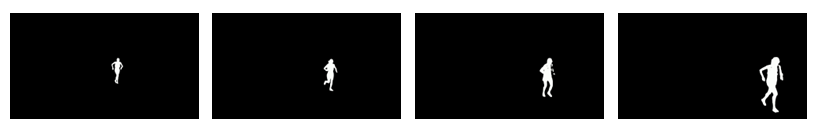

# Yearbook: A Multi-Year In-the-Wild Gait Dataset for Long-Term Person Re-Identification

This repository provides access instructions for the Yearbook dataset, along with the necessary tools and configuration files required to process and use the dataset within the  framework.

## Overview

The Yearbook dataset consists of short video sequences of a few seconds in duration, acquired during four editions of a running event held in four different years. For each year, recordings were captured at three different locations along the race route.

These video sequences show silhouettes of the individuals, represented in white over a black background.

<p align="center"></p>

## Data Format

Each video sequence is identified by a numeric code with the format `nnn_a_b` where:

* `nnn`: is a unique identifier for each individual (values from `000` to `999`)
* `a`: is the yearly race edition (values from `1` to `4`)
* `b`: is the acquisition location within the corresponding edition (values from `1` to `3`)

## Access and Usage Restrictions

The Yearbook dataset is made available solely for non-commercial scientific research and educational purposes.

Access is granted on a case-by-case basis. Researchers interested in using the dataset must complete the  and send it to:

✉️ oliverio.santana@ulpgc.es

⚠️ **Important Notice**

The Yearbook dataset is not publicly available at this time. It will be released upon acceptance of the associated research paper, which is currently under review. This measure is taken to ensure consistency between the dataset description and the final published version, and to avoid potential discrepancies during the review process.

## Dataset Generation

The script `generate_yearbook_dataset.py` processes the raw videos to generate the dataset in a format compatible with OpenGait. The usage of the script is:

```bash
python generate_yearbook_dataset.py <input> <output>
```

where:

* The input is the directory that contains the videos.
* The output is a new directory with the following structure:
	- A `png` directory with all the frames of the videos stored as separate files.
	- A `pkl` directory with the dataset formatted as expected by OpenGait.
	- A `Yearbook.json` file with the dataset split following the OpenGait format.

## Adaptation to OpenGait

To use Yearbook in OpenGait, the following steps must be performed:

* Create the directory `OpenGait/datasets/Yearbook` and copy the file `Yearbook.json` into it.
* Copy the configuration files into the corresponding directories inside `OpenGait/configs`:
	- `gaitset/GaitSet_Yearbook.yaml`
	- `gaitpart/GaitPart_Yearbook.yaml`
	- `gaitgl/GaitGL_Yearbook.yaml`
	- `gaitbase/GaitBase_Yearbook.yaml`
* Modify the file `OpenGait/opengait/evaluation/evaluator.py` to add the function `evaluate_Yearbook`.

Both the YAML configuration files and the evaluation function are provided in this repository.

In addition, training models with Yearbook requires a modification in the OpenGait codebase. Inside the file `OpenGait/opengait/modeling/models/gaitgl.py`, `Yearbook` must be added to the following line:

```python
if dataset_name in ['OUMVLP', 'GREW']:
```

📌 **Disclaimer**

This repository builds upon the OpenGait framework. Users must ensure that they comply with the original OpenGait usage terms and restrictions when using or extending this codebase.

All rights and obligations associated with OpenGait remain unchanged, and users are responsible for respecting its original usage conditions and intended non-commercial research purpose.
